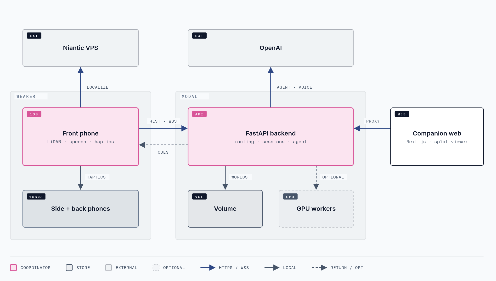
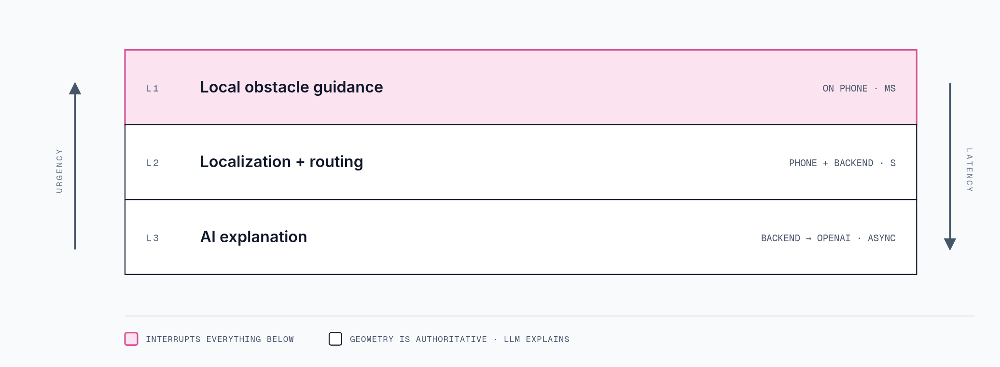
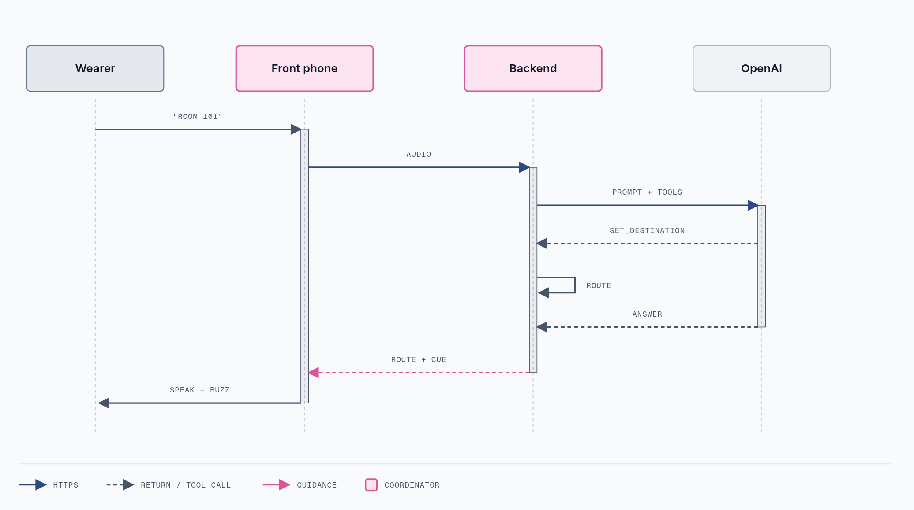
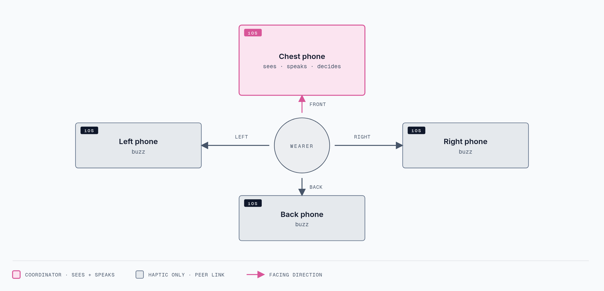
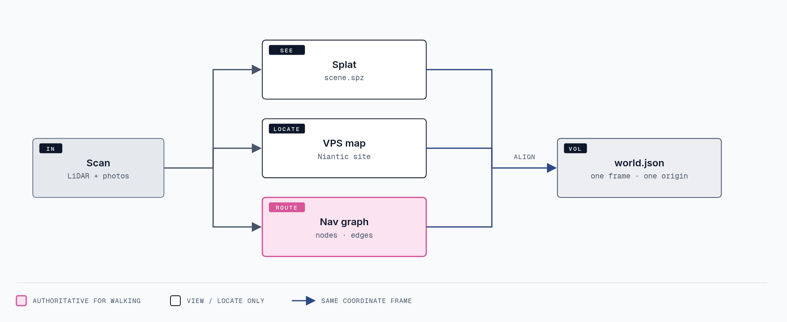
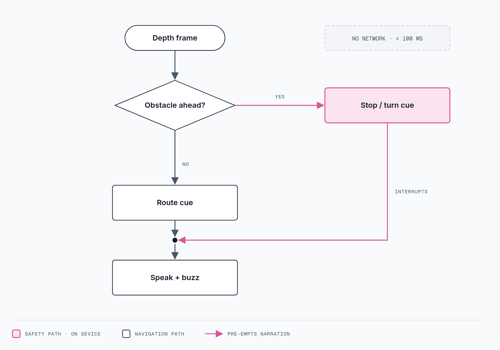

# hackthenorth

**Wander** — a wearable indoor navigation assistant for blind and low-vision users. Four LiDAR iPhones on the body, one FastAPI backend on Modal, one companion web app.

## Architecture



### Guidance layers



### Asking for a destination



### Phone roles



### Map products



### Obstacle cue flow



Sources: [`docs/architecture/`](docs/architecture/) (`.html` source, `.svg`, `.png`).

## Layout

```text
htn/
├── apps/
│   ├── web/                     # Next.js companion web app
│   │   ├── src/
│   │   │   └── app/             # App Router pages, layouts, and global styles
│   │   └── public/              # Static web assets
│   └── ios/                     # Swift iPhone app, shared across device roles
│       ├── App/                # App entry point and composition
│       ├── Features/           # Navigation, obstacle cues, voice interaction
│       ├── Services/           # ARKit, Shepherd, Niantic SDK, networking, speech
│       └── Resources/          # Native app assets
├── services/
│   └── backend/                # Python / FastAPI backend
│       ├── app/
│       │   ├── api/            # HTTP endpoints and WebSocket connections
│       │   ├── routing/        # Waypoint routing and navigation progress
│       │   └── integrations/   # OpenAI and other external service clients
│       └── deployment/         # Modal deployment configuration
├── shared/
│   └── contracts/              # Message schemas shared by the apps and backend
├── maps/
│   ├── navigation/             # Waypoints, destinations, graph and alignment data
│   └── assets/                 # Local exported splats and meshes (ignored by Git)
└── docs/                       # Architecture, setup notes, and demo plan
```

## Team ownership

| Area | Owner |
| --- | --- |
| iPhone app, obstacle sensing, and speech | iOS developer |
| Mapping, Niantic localization, and map alignment | Localization developer |
| FastAPI, routing, and Modal deployment | Backend developer |
| Next.js companion app and splat viewer | Web developer |

The iOS and localization developers share one native app. Agree on the camera/AR session boundary before implementation. Message contracts and map coordinates are shared team responsibilities.

## Notes

- The web app uses Next.js with the App Router, TypeScript, Tailwind CSS, and ESLint. Run npm run dev from apps/web to start it.
- The first MVP uses the chest phone; the same iOS app can later support left, right, and back device roles.
- Niantic localization runs through the phone SDK. Modal hosts the custom backend.
- Exported map assets belong in `maps/assets/`; navigation metadata belongs in `maps/navigation/`.
- Worlds are stored on a Modal Volume as `worlds/<id>/world.json` + `worlds/<id>/<version>/scene.spz` (contract in `shared/contracts/`). The web app renders them with Spark/Three.js at `/worlds/<id>` (measure distances, tag stops, save the graph back), reading through FastAPI when `WANDER_API_URL` is set or from `maps/assets/worlds/` locally (`npm run world:add` in `apps/web` registers an export).
- Per-area docs: `apps/ios/README.md`, `apps/web/README.md`, `services/backend/WORLDS_MIGRATION.md`, `shared/contracts/README.md`, `shared/contracts/service-handoffs.md`.
