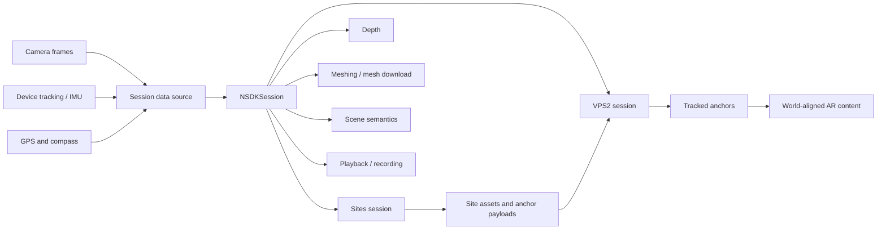
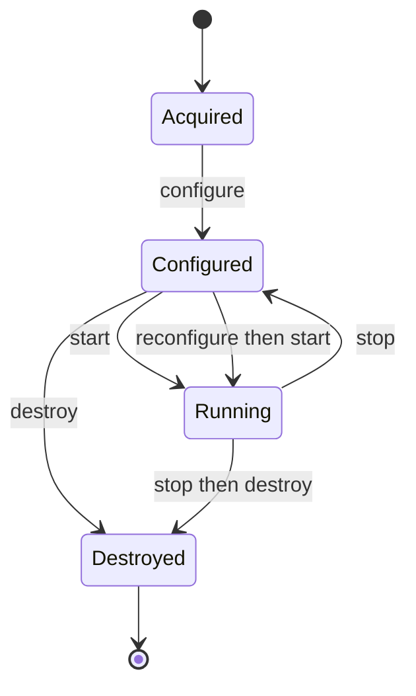
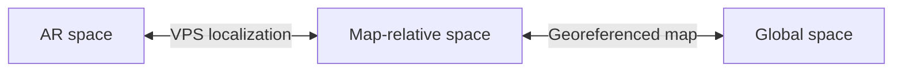
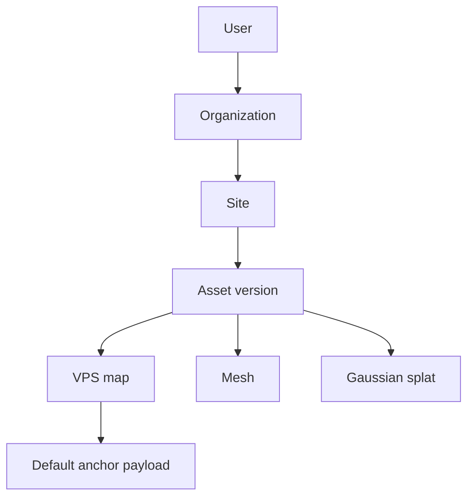
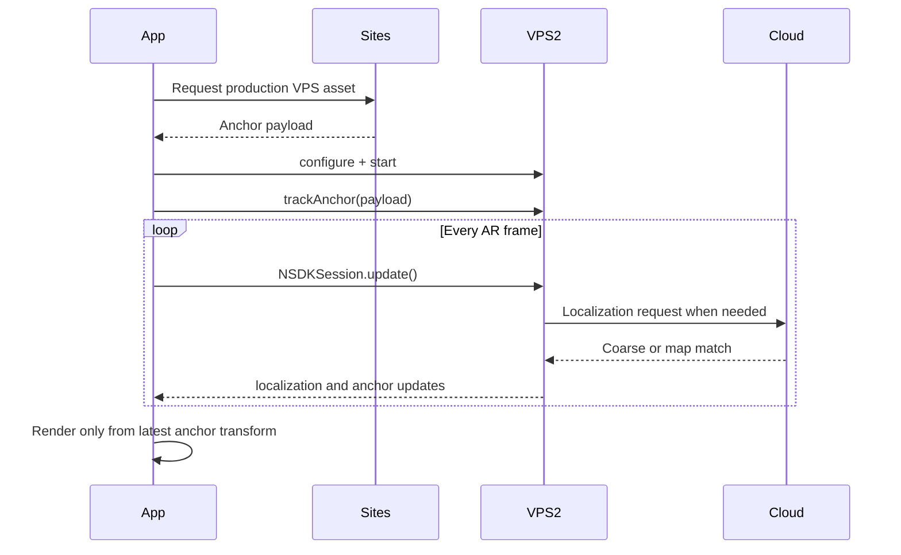
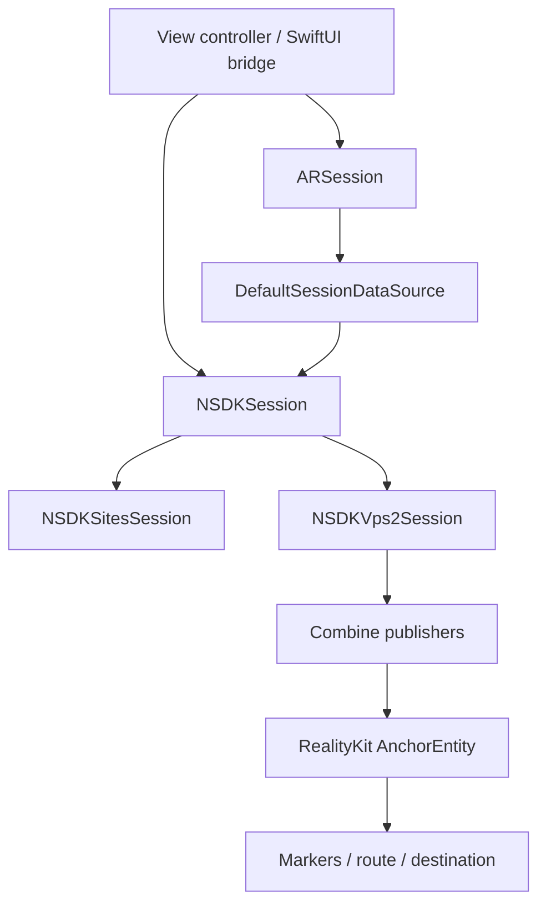
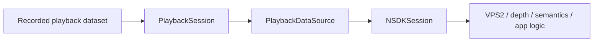

# Niantic Spatial SDK DeepWiki

This page is the entry point to the local Niantic Spatial documentation mirror. It explains how the SDK fits together, identifies the canonical references for each workflow, and links concepts to their Swift, Kotlin, and Unity APIs.

The mirror is reference material rather than application source code. For current development, prefer the `llms-*` files: they are compact, searchable, and preserve all platform tabs. The HTML-derived Markdown under `nsdk/` usually contains only the default Unity tab.

## Contents

- [Documentation map](#documentation-map)
- [System at a glance](#system-at-a-glance)
- [Core runtime architecture](#core-runtime-architecture)
- [Spatial model](#spatial-model)
- [Sites and spatial assets](#sites-and-spatial-assets)
- [VPS2 localization](#vps2-localization)
- [Anchors and persistent content](#anchors-and-persistent-content)
- [Scaniverse capture pipeline](#scaniverse-capture-pipeline)
- [Swift and iOS implementation](#swift-and-ios-implementation)
- [Wayfinding architecture](#wayfinding-architecture)
- [AR effect features](#ar-effect-features)
- [Authentication](#authentication)
- [Playback and testing](#playback-and-testing)
- [Errors and diagnostics](#errors-and-diagnostics)
- [Common failure modes](#common-failure-modes)
- [Platform API map](#platform-api-map)
- [Recommended reading paths](#recommended-reading-paths)
- [Glossary](#glossary)

## Documentation map

| Location | Purpose | When to use it |
| --- | --- | --- |
| [`README.md`](README.md) | Mirror provenance and directory overview | Start here when navigating the archive itself |
| [`llms-nsdk/`](llms-nsdk/) | Current guides with Swift, Kotlin, and Unity tabs expanded | Primary conceptual and implementation documentation |
| [`llms-api-swift.txt`](llms-api-swift.txt) | Swift API index | Find a Swift symbol before opening its page |
| [`llms-api-swift/`](llms-api-swift/) | Per-symbol Swift API reference | Exact signatures, properties, and lifecycle behavior |
| [`llms-api-kotlin.txt`](llms-api-kotlin.txt) | Kotlin API index | Find a Kotlin symbol |
| [`llms-api-kotlin/`](llms-api-kotlin/) | Per-symbol Kotlin API reference | Android implementation details |
| [`llms-api-unity.txt`](llms-api-unity.txt) | Unity API index | Find a C# or XR subsystem symbol |
| [`llms-api-unity/`](llms-api-unity/) | Per-symbol Unity API reference | Unity and AR Foundation implementation details |
| [`llms-scaniverse/`](llms-scaniverse/) | Scan capture, processing, and publishing | Build or troubleshoot Sites and VPS maps |
| [`nsdk/`](nsdk/) | HTML-derived current guides | Preserve original structure; generally Unity-first |
| [`api/`](api/) | HTML-derived API references | Use when original tables or live-site links matter |
| [`nsdk/3.17.0/`](nsdk/3.17.0/) | Legacy ARDK/Lightship documentation | Existing pre-NSDK integrations only |

### Current versus legacy APIs

The current API generation uses these names:

- Swift: `NSDKSession`, `NSDKVps2Session`, `NSDKSitesSession`
- Kotlin: `NSDKSession`, `VPS2Session`, Sites subpackage APIs
- Unity: `NianticSpatial.NSDK`, `ARVps2Manager`, XR subsystems

The `nsdk/3.17.0/` tree belongs to the older ARDK/Lightship generation. Do not mix its Persistent Anchors, VPS Coverage, or World Positioning APIs into a current NSDK/VPS2 implementation unless performing a migration.

## System at a glance

NSDK is a continuous spatial processing system. The application supplies recent camera and sensor samples, advances the SDK once per frame, and reads the latest localization, anchor, depth, mesh, or semantic state.



The shortest path to a localized experience is:

1. Capture and publish a Site in Scaniverse.
2. Create one `NSDKSession`.
3. Feed it AR camera and sensor data every frame.
4. Use Sites to obtain the Site's production VPS anchor payload.
5. Configure and start VPS2.
6. Pass the payload to `trackAnchor`.
7. Wait for that anchor to become tracked.
8. Render content relative to its latest transform.

Canonical overview: [`llms-nsdk/core_concepts.txt`](llms-nsdk/core_concepts.txt).

## Core runtime architecture

### One root session

`NSDKSession` is the root object for SDK access. NSDK supports one active root session per process. Create it once, reuse it for the application's lifetime, and tear it down before creating another root session.

Feature objects such as VPS2, Sites, depth, meshing, scanning, and scene segmentation are acquired from that root session. They are not independent SDK instances.

Swift reference:

- [`NSDKSession`](llms-api-swift/NSDK.class-NSDKSession.txt)
- [`acquireVps2Session`](llms-api-swift/NSDK.NSDKSession.method-acquireVps2Session.txt)
- [`acquireSitesSession`](llms-api-swift/NSDK.NSDKSession.method-acquireSitesSession.txt)
- [`destroyAll`](llms-api-swift/NSDK.NSDKSession.method-destroyAll.txt)

### Frame-driven update loop

AR state changes continuously. NSDK therefore consumes the latest state once per rendered or captured frame rather than emitting an event for every sensor change.

For Swift:

```swift
func session(_ session: ARSession, didUpdate frame: ARFrame) {
    nsdkSession.update()
}
```

Assigning a data source is not enough. If `update()` is not called for each ARKit frame, camera-dependent features such as VPS localization, depth, meshing, and semantics do not run, and the SDK may not emit an explicit error.

References:

- [`llms-nsdk/setup.txt`](llms-nsdk/setup.txt), “Provide frame and sensor data” and “Call update for each ARKit frame”
- [`NSDKSession.update`](llms-api-swift/NSDK.NSDKSession.method-update.txt)
- [`DefaultSessionDataSource`](llms-api-swift/NSDK.class-DefaultSessionDataSource.txt)

### Feature-session lifecycle

Most active feature sessions follow this state machine:



Configuration generally applies only while stopped. Stopping VPS2 resets tracked-anchor state. Always stop it before starting it again.

### Main-thread ownership

Acquire feature sessions and access NSDK components on the main thread. The SDK's asynchronous request methods already perform their background work without requiring an application-created worker thread.

## Spatial model

A pose is a position and orientation interpreted in a coordinate space. Pose numbers are meaningless without knowing that space.

### Coordinate spaces

| Space | Origin | Strength | Limitation | Typical use |
| --- | --- | --- | --- | --- |
| AR space | Current session origin | Smooth, locally accurate tracking | Drifts and resets each session | Rendering and local interactions |
| Map-relative space | Origin of a processed VPS map | Precise and stable across sessions | Requires successful map localization | Persistent indoor or site-relative content |
| Global space | Earth coordinates | Common world reference | GPS and heading may be inaccurate | Discovery, routing, and coarse navigation |

### Transform graph



The AR-to-map transform exists after VPS map localization. The map-to-global transform exists only when the map is georeferenced. If both exist, NSDK can compose them to convert between AR and global coordinates.

### Coordinate handedness

- Unity is left-handed: `+Z` points forward.
- ARKit and ARCore are right-handed: `-Z` points forward.
- Mesh and pose data may require explicit conversion when crossing platform or rendering conventions.

Do not manually flip axes unless the API's documented convention requires it. Prefer SDK conversion methods such as VPS2 `getPose` and `getGeolocation`.

### Accuracy domains

Map-relative accuracy and global accuracy are separate:

- A Site can localize precisely against its map while having an inaccurate latitude, longitude, or heading.
- Editing georeferencing changes global alignment but does not change local map-relative accuracy.
- Small rotation errors relative to geographic north create larger positional errors farther from the map origin.

References:

- [`llms-nsdk/core_concepts.txt`](llms-nsdk/core_concepts.txt)
- [`llms-nsdk/features/vps2.txt`](llms-nsdk/features/vps2.txt), “Geo-alignment and absolute accuracy”

## Sites and spatial assets

The Niantic Spatial cloud model is:



### Entities

- **User**: authenticated identity.
- **Organization**: permission and ownership boundary.
- **Site**: a physical place represented by one or more scans.
- **Asset version**: processed output generated from a selected set of scans.
- **Asset**: VPS information, mesh, splat, or related spatial data.
- **Production asset version**: the version available to authenticated applications.

All Sites responses are scoped to the authenticated user's permissions.

### Discovering a Site at runtime

Applications can either:

- browse organizations, Sites, and assets; or
- request nearby Site assets by latitude, longitude, radius, and asset type.

For Swift navigation, the most direct discovery API is:

[`requestSiteAssetsByLocation`](llms-api-swift/NSDK.NSDKSitesSession.method-requestSiteAssetsByLocation.txt)

The resulting VPS asset contains an anchor payload. Pass that payload—not the Site ID—to VPS2 `trackAnchor(payload:)`.

References:

- [`llms-nsdk/features/sites.txt`](llms-nsdk/features/sites.txt)
- [`llms-nsdk/how-to/sites/getting_started.txt`](llms-nsdk/how-to/sites/getting_started.txt)
- [`NSDKSitesSession`](llms-api-swift/NSDK.class-NSDKSitesSession.txt)

## VPS2 localization

VPS2 combines local AR tracking, device sensors, visual data, and optionally cloud services to estimate the device's relationship to the world.

### Coarse localization

Coarse localization provides geoposition and heading without requiring a Site map.

It can use:

1. **Local sensor fusion**: GPS, magnetometer, and local AR tracking.
2. **Cloud geopositioning**: camera imagery sent to Niantic services when universal localization is enabled.

Cloud geopositioning can improve results in difficult GPS environments, but it requires network access. The first cloud result in an uncached region may take 60 seconds or more.

### Precise localization

Precise localization matches live camera imagery against a processed VPS map and computes a six-degree-of-freedom map-relative pose.

Requirements:

- the application can access the Site;
- the Site has a processed, Production VPS asset;
- VPS map localization is enabled;
- the application calls `trackAnchor` with the Site's anchor payload;
- current camera imagery contains enough mapped visual features.

Starting VPS2 begins general coarse positioning. It does not automatically localize to a specific Site.

### Two independent status models

| Status | Swift type | Values | Answers |
| --- | --- | --- | --- |
| Device localization | `Vps2TrackingState` | `unavailable`, `coarse`, `precise` | How well does the device know its world position? |
| Anchor tracking | `VpsAnchorUpdate.AnchorTrackingState` | `notTracked`, `limited`, `tracked` | Is this anchor reliable for placing content? |

Never use device `precise` as a substitute for anchor `tracked`. A device can have a precise geoposition while an individual Site anchor remains limited or untracked.

### VPS2 flow



Swift references:

- [`NSDKVps2Session`](llms-api-swift/NSDK.class-NSDKVps2Session.txt)
- [`NSDKVps2Session.Configuration`](llms-api-swift/NSDK.NSDKVps2Session.struct-Configuration.txt)
- [`trackAnchor`](llms-api-swift/NSDK.NSDKVps2Session.method-trackAnchor.txt)
- [`Vps2Localization`](llms-api-swift/NSDK.struct-Vps2Localization.txt)
- [`VpsAnchorUpdate`](llms-api-swift/NSDK.struct-VpsAnchorUpdate.txt)

Guide: [`llms-nsdk/how-to/vps2/adding_vps2.txt`](llms-nsdk/how-to/vps2/adding_vps2.txt).

## Anchors and persistent content

An anchor is a real-world reference pose. Content should be attached to an anchor rather than directly to a one-time device or world transform.

### Anchor states

- **Not tracked**: no usable pose.
- **Limited**: coarse estimate; content may visibly drift or jump.
- **Tracked**: precise map-relative alignment suitable for stable placement.

Anchor poses remain dynamic even after tracking succeeds. Localization refinements can adjust the anchor's AR-space transform. Keep the rendered parent synchronized with every relevant `anchorUpdated` event.

### Persistent placement pattern

Store:

```text
Site anchor payload
+ content transform relative to that anchor
+ application content identifier and metadata
```

Restore:

1. Start a new AR and NSDK session.
2. Track the same Site anchor using the saved payload.
3. Wait for the anchor to become tracked.
4. Create or update an AR parent entity from the latest anchor transform.
5. Apply the saved anchor-local content transform beneath that parent.

Do not store a transient ARKit world transform as if it were globally persistent. AR space resets on each session.

Guide: [`llms-nsdk/how-to/vps2/placing_virtual_content.txt`](llms-nsdk/how-to/vps2/placing_virtual_content.txt).

## Scaniverse capture pipeline

### Capture-to-production workflow

```mermaid
flowchart LR
    Capture[Capture overlapping scans] --> Review[Review and validate]
    Review --> Upload[Upload scans]
    Upload --> Process[Generate asset version]
    Process --> Assets[VPS map / mesh / splat]
    Assets --> Test[Test localization]
    Test --> Production[Set as Production]
    Production --> SDK[Discover through Sites API]
```



1. Sign into the current Scaniverse experience with the correct organization.
2. Create a private Site.
3. Capture one or more overlapping scans.
4. Review each scan and test immediate localization where available.
5. Upload selected scans.
6. Generate the required assets.
7. Inspect the reconstruction and georeferencing.
8. Test at the physical location.
9. Set the chosen asset version to Production.

A mobile scan supports up to approximately five minutes and 500 m². Larger environments require multiple overlapping scans in the same Site.

### Capture quality

Good scans:

- move slowly and continuously;
- contain distinctive visual features;
- include multiple angles, heights, and distances;
- overlap within a scan and between adjacent scans;
- connect doorways and transitions strongly;
- reflect likely end-user lighting conditions.

Poor localization commonly follows from:

- featureless walls or floors;
- reflective, transparent, or repetitive surfaces;
- motion blur;
- moving people or objects dominating the image;
- weak overlap between rooms or scan segments;
- substantial environmental changes after capture.

### Asset types

| Asset | Primary purpose |
| --- | --- |
| VPS map | Visual localization and persistent spatial alignment |
| Mesh | Geometry, occlusion, physics, inspection, or path context |
| Gaussian splat | High-quality visual reconstruction |

A generated asset is not available to SDK applications until its asset version is Production.

Scaniverse references:

- [`Quickstart`](llms-scaniverse/quickstart.txt)
- [`Scan techniques`](llms-scaniverse/techniques.txt)
- [`Troubleshooting`](llms-scaniverse/troubleshoot.txt)
- [`Advanced tools`](llms-scaniverse/advanced_tools.txt)
- [`360 camera workflow`](llms-scaniverse/360camera.txt)
- [`Migration guide`](llms-scaniverse/migration_guide.txt)

## Swift and iOS implementation

### Installation

Add the Swift package:

```text
https://github.com/nianticspatial/nsdk-library-xcframework
```

Select the `NSDK` product and set it to **Embed & Sign**. Add camera and location usage descriptions to `Info.plist`; iOS terminates the application when either protected resource is accessed without its corresponding description.

Full guide: [`llms-nsdk/setup.txt`](llms-nsdk/setup.txt), “Set up the NSDK in Swift.”

### Runtime object graph



### Minimal lifecycle

```swift
let nsdkSession = NSDKSession(accessToken: accessToken)
let dataSource = DefaultSessionDataSource(
    session: arSession,
    orientationReporter: orientationReporter
)
nsdkSession.dataSource = dataSource

let vps2Session = nsdkSession.acquireVps2Session()
let config = NSDKVps2Session.Configuration(
    universalLocalizationEnabled: true,
    vpsMapLocalizationEnabled: true
)
try vps2Session.configure(with: config)
vps2Session.start()

let anchorId = try vps2Session.trackAnchor(payload: anchorPayload)
```

The exact initializer and error behavior should be checked against the current per-symbol pages because generated overview examples can lag individual method references.

### Anchor rendering

Subscribe to `anchorUpdated`. For the anchor ID returned by `trackAnchor`, read `trackingData.targetAnchorTransform`, update a RealityKit parent entity, and place route content beneath it using anchor-local transforms.

Relevant pages:

- [`Anchor tracking state`](llms-api-swift/NSDK.VpsAnchorUpdate.enum-AnchorTrackingState.txt)
- [`Anchor tracking data`](llms-api-swift/NSDK.VpsAnchorUpdate.struct-TrackingData.txt)
- [`getPose`](llms-api-swift/NSDK.NSDKVps2Session.method-getPose.txt)
- [`deviceGeolocation`](llms-api-swift/NSDK.NSDKVps2Session.method-deviceGeolocation.txt)

### Geographic content

Use VPS2 conversion methods to turn a destination latitude, longitude, and altitude into a pose in current AR space. Avoid implementing a separate ad hoc geographic-to-AR transform when a valid localization snapshot is available.

For high-precision Site content, prefer map-relative anchor placement. Use global coordinates for discovery, broad routing, and content intentionally authored in geographic coordinates.

## Wayfinding architecture

The mirrored five-part VPS2 tutorial defines the canonical wayfinding application structure.

### Application stages

1. **Bootstrap and permissions**
   - authenticate;
   - request camera and location access;
   - create live or playback AR input;
   - create the single root NSDK session.
2. **Site discovery**
   - fetch organizations and Sites;
   - filter for Production VPS assets with nonempty anchor payloads;
   - display Sites on a map.
3. **Localization**
   - configure VPS2 for universal and VPS-map localization;
   - start VPS2;
   - track the selected Site anchor payload.
4. **Guidance**
   - use coarse data while approaching the Site;
   - update guidance from anchor transforms;
   - switch to precise content once the anchor is tracked.
5. **Spatial rendering**
   - render a destination marker;
   - optionally show floor-aligned chevrons while tracking is limited;
   - optionally download and align the Site mesh after precise tracking.

### Suggested state model

```text
idle
  -> requestingPermissions
  -> loadingSites
  -> siteSelected
  -> startingVps2
  -> localizing
       -> coarse / anchor limited
       -> precise / anchor tracked
  -> navigating
  -> stopped or error
```

Model device localization and anchor tracking separately. Do not collapse both into a single Boolean `isLocalized`.

### Tutorial pages

1. [`Getting started`](llms-nsdk/vps2e2e/vps2-e2e-getting-started.txt)
2. [`Application landing and session setup`](llms-nsdk/vps2e2e/vps2-e2e-landing-page.txt)
3. [`Map and Site selection`](llms-nsdk/vps2e2e/vps2-e2e-map-view.txt)
4. [`VPS2 localization`](llms-nsdk/vps2e2e/vps2-e2e-ar-effect-1.txt)
5. [`AR wayfinding effect`](llms-nsdk/vps2e2e/vps2-e2e-ar-effect-2.txt)

## AR effect features

These features share the root session and frame input but serve different rendering needs.

### Depth

Produces estimated scene depth for screen-to-world conversion, occlusion, and environment-aware effects. Availability and quality depend on configuration, model readiness, and optional LiDAR use.

- [`Feature overview`](llms-nsdk/features/depth.txt)
- [`Add depth`](llms-nsdk/how-to/ar/depth/adding_depth.txt)
- [`Display depth`](llms-nsdk/how-to/ar/depth/display_depth.txt)
- [`Convert screen point to world position`](llms-nsdk/how-to/ar/depth/convert_point_world_position.txt)

### Occlusion

Allows real geometry to hide virtual content. It can use depth and NSDK-specific interpolation or suppression behavior.

- [`Feature overview`](llms-nsdk/features/occlusion.txt)
- [`Add occlusion`](llms-nsdk/how-to/ar/adding_occlusion.txt)
- [`Set up real-world occlusion`](llms-nsdk/how-to/ar/setup_real_world_occlusion.txt)

### Meshing

Builds chunked geometry from the observed environment. Uses include physics, occlusion, navigation context, and semantic filtering.

- [`Feature overview`](llms-nsdk/features/meshing.txt)
- [`Add meshing`](llms-nsdk/how-to/ar/meshing/adding_meshing.txt)
- [`Mesh physics`](llms-nsdk/how-to/ar/meshing/meshing_physics_real_world.txt)
- [`Semantic mesh filtering`](llms-nsdk/how-to/ar/meshing/semantic_mesh_filtering.txt)

### Semantics

Classifies image regions or scene elements into semantic channels. It can drive filtering and context-aware behavior.

- [`Feature overview`](llms-nsdk/features/semantics.txt)
- [`Add semantics`](llms-nsdk/how-to/ar/adding_semantics.txt)
- [`Query real objects`](llms-nsdk/how-to/ar/query_semantics_real_objects.txt)

### Model preloading

Depth, semantics, and related learned features may require model loading. Preloading can move that cost out of the user-critical interaction path.

- [`Model preloading`](llms-nsdk/features/model_preloading.txt)
- [`Meshing model preloading`](llms-nsdk/features/model_preloading_meshing.txt)
- [`Semantics model preloading`](llms-nsdk/features/model_preloading_semantics.txt)

## Authentication

### Development

Developer tokens are intended for development and internal testing. They are organization-level secrets, shown once, scoped to specific APIs, and expire. Do not commit them to the repository or ship them as a production authentication design.

Typical scopes:

- Scaniverse API for Sites and asset discovery;
- VPS API for localization.

Guide: [`llms-nsdk/auth_developer_token.txt`](llms-nsdk/auth_developer_token.txt).

### Production

A production application should obtain short-lived access credentials through an application backend rather than embedding a long-lived organization credential in the client.

References:

- [`Authorization overview`](llms-nsdk/auth_getting_started.txt)
- [`Client authorization`](llms-nsdk/auth_client.txt)
- [`Backend authorization`](llms-nsdk/auth_backend.txt)

### Auth failure behavior

A successful build does not prove credentials are configured. Surface authorization status explicitly, distinguish authentication from permission failures, and refresh credentials before retrying protected requests.

Swift session methods:

- [`setAccessToken`](llms-api-swift/NSDK.NSDKSession.method-setAccessToken.txt)
- [`getAccessAuthInfo`](llms-api-swift/NSDK.NSDKSession.method-getAccessAuthInfo.txt)
- [`getRefreshAuthInfo`](llms-api-swift/NSDK.NSDKSession.method-getRefreshAuthInfo.txt)

## Playback and testing

Spatial behavior is difficult to develop when the physical Site is unavailable. NSDK playback datasets provide repeatable frame and sensor input for development and regression testing.



Use playback to test:

- application state transitions;
- frame-loop integration;
- localization UI;
- anchor update handling;
- mesh and AR rendering logic;
- deterministic regressions.

Playback does not replace final on-site validation. Live lighting, environmental changes, network conditions, camera motion, and map coverage still affect localization.

References:

- [`Playback overview`](llms-nsdk/features/playback.txt)
- [`Create a playback dataset`](llms-nsdk/how-to/playback/create_playback_dataset.txt)
- [`Set up playback`](llms-nsdk/how-to/playback/setting_up_playback.txt)

## Errors and diagnostics

### Diagnostic layers

| Layer | What to inspect |
| --- | --- |
| Root session | Authorization, data-source readiness, update cadence |
| Feature session | Configuration and `featureStatus()` |
| Localization request | Request records, network/auth/quota/map errors |
| Device localization | `unavailable`, `coarse`, or `precise` |
| Anchor | `notTracked`, `limited`, or `tracked`, plus reason |
| Rendering | Coordinate convention, parent transform, stale transforms |

### Swift error families

- `NSDKError`: invalid argument, invalid operation, null argument, or unknown errors.
- `NSDKFeatureStatus`: initialization, bad credential, or configuration state.
- `Vps2LocalizationError`: authentication, camera angle, tracking, network, map, quota, permission, or server failures.
- `VpsAnchorUpdate.AnchorTrackingState.Reason`: initialization, no visual localization, permission, network, internal, or removal reasons.
- Sites result errors: HTTP, network, parsing, invalid request, or unexpected failures.

References:

- [`Vps2LocalizationError`](llms-api-swift/NSDK.enum-Vps2LocalizationError.txt)
- [`Localization request record`](llms-api-swift/NSDK.struct-Vps2LocalizationRequestRecord.txt)
- [`Anchor tracking reason`](llms-api-swift/NSDK.VpsAnchorUpdate.AnchorTrackingState.enum-Reason.txt)
- [`Getting logs`](llms-nsdk/getting_logs.txt)

### Useful telemetry

During development, record at least:

- root session creation and destruction;
- data-source readiness;
- per-second update cadence rather than every frame;
- VPS2 start/stop/configuration result;
- selected Site and asset identifiers, excluding secret payload contents;
- device tracking-state transitions;
- anchor tracking-state transitions and reasons;
- localization request failures;
- network and authorization state.

Do not log access tokens or complete anchor payloads.

## Common failure modes

### Nothing localizes and no error appears

Likely cause: `NSDKSession.update()` is not called for every new AR frame, or the data source is not ready.

Check:

- the same ARSession is used by the renderer and data source;
- the AR session is running;
- delegate callbacks arrive;
- orientation reporting is valid;
- `update()` is invoked once per frame.

### Device is precise but content is unstable

Likely cause: the application treats device localization as anchor readiness.

Fix: gate world-aligned content on the selected anchor's state and update its parent transform from every anchor update.

### Site never reaches precise localization

Check:

- the asset version is Production;
- the application has permission to access its organization and Site;
- the exact anchor payload is passed to `trackAnchor`;
- VPS map localization is enabled;
- the user is physically within the scanned area or using the matching playback dataset;
- the camera sees distinctive mapped features;
- lighting and environment have not changed substantially.

### Content restores in the wrong place

Likely causes:

- an AR-session world transform was persisted rather than an anchor-local transform;
- the content is not parented beneath the tracked anchor;
- a stale anchor transform is cached;
- coordinate handedness was converted incorrectly.

### Site is correct locally but wrong on the map

Likely cause: poor georeferencing, especially heading rotation. Correct the Site with Scaniverse's georeference tools. Continue using map-relative poses for precise in-Site rendering.

### Nearby Site query returns nothing

Check:

- location permission and GPS coordinates;
- search radius;
- authenticated organization access;
- asset type filter;
- Production deployment state;
- network and Sites API scope.

### Cloud geopositioning appears stuck

The first response can take 60 seconds or more in some regions. Keep a visible initializing state, inspect request records, and distinguish this from VPS map localization once a Site anchor is being tracked.

## Platform API map

| Concern | Swift | Kotlin | Unity |
| --- | --- | --- | --- |
| Root session | `NSDKSession` | `NSDKSession` | XR loader / NSDK context |
| Live data source | `DefaultSessionDataSource` | `NsdkSessionDataSource` or direct frame submission | AR Foundation integration |
| Frame advance | `NSDKSession.update()` | `prepareFrame()` + `update()` or `sendFrame()` | Managed through XR lifecycle |
| VPS2 | `NSDKVps2Session` | `VPS2Session` | `ARVps2Manager` / VPS2 subsystem |
| Sites | `NSDKSitesSession` | Sites session | Sites APIs |
| Rendering | RealityKit / ARKit | SceneView / ARCore | Unity / AR Foundation |
| Async model | Combine and Swift concurrency | Coroutines and flows | C# events, tasks, subsystem polling |
| Coordinate frame | Right-handed, `-Z` forward | Right-handed, `-Z` forward | Left-handed, `+Z` forward |

Platform indexes:

- [Swift API](llms-api-swift.txt)
- [Kotlin API](llms-api-kotlin.txt)
- [Unity API](llms-api-unity.txt)

## Recommended reading paths

### Build an iOS wayfinding application

1. [`Core concepts`](llms-nsdk/core_concepts.txt)
2. [`Swift setup`](llms-nsdk/setup.txt)
3. [`Authorization`](llms-nsdk/auth_getting_started.txt)
4. [`First localization`](llms-nsdk/first_localization.txt)
5. [`Sites`](llms-nsdk/features/sites.txt)
6. [`VPS2`](llms-nsdk/features/vps2.txt)
7. [`Get started with VPS2`](llms-nsdk/how-to/vps2/adding_vps2.txt)
8. [`Place virtual content`](llms-nsdk/how-to/vps2/placing_virtual_content.txt)
9. [Five-part wayfinding tutorial](llms-nsdk/vps2e2e/)
10. [Swift API index](llms-api-swift.txt)

### Create a new localized Site

1. [`Scaniverse quickstart`](llms-scaniverse/quickstart.txt)
2. [`Scan techniques`](llms-scaniverse/techniques.txt)
3. [`First localization`](llms-nsdk/first_localization.txt)
4. [`Scan troubleshooting`](llms-scaniverse/troubleshoot.txt)
5. [`Sites API`](llms-nsdk/how-to/sites/getting_started.txt)

### Add environment understanding

1. [`AR effects overview`](llms-nsdk/features/ar_effects.txt)
2. [`Depth`](llms-nsdk/features/depth.txt)
3. [`Occlusion`](llms-nsdk/features/occlusion.txt)
4. [`Meshing`](llms-nsdk/features/meshing.txt)
5. [`Semantics`](llms-nsdk/features/semantics.txt)
6. [`Model preloading`](llms-nsdk/features/model_preloading.txt)

### Diagnose localization

1. [`VPS2 status model`](llms-nsdk/features/vps2.txt)
2. [`Getting logs`](llms-nsdk/getting_logs.txt)
3. [`Scan troubleshooting`](llms-scaniverse/troubleshoot.txt)
4. [`Playback`](llms-nsdk/features/playback.txt)
5. Platform-specific localization request and anchor update API pages

### Migrate an older Lightship project

1. [`NSDK migration guide`](llms-nsdk/migration_guide.txt)
2. [`VPS2 migration`](llms-nsdk/features/vps2_migration.txt)
3. [`Scaniverse migration`](llms-scaniverse/migration_guide.txt)
4. Compare legacy [`nsdk/3.17.0/`](nsdk/3.17.0/) symbols with current platform indexes

## Glossary

**Anchor:** A tracked reference pose used to attach content to the real world.

**Anchor payload:** An opaque serialized value identifying an anchor that VPS2 can track. Treat it as application data and do not infer its structure.

**AR space:** The local coordinate system created when the current AR session starts.

**Asset version:** A processed set of spatial assets generated from selected Site scans.

**Coarse localization:** Approximate global geoposition and heading without a successful VPS map match.

**Geoposition:** Latitude, longitude, altitude, and related accuracy information.

**Georeferencing:** Alignment between a Site's map coordinate system and Earth coordinates.

**Map-relative space:** The coordinate system defined by a processed VPS map.

**Pose:** Position and orientation within a named coordinate space.

**Precise localization:** Visual localization against a Site's VPS map, producing a stable map-relative alignment.

**Production:** The asset-version deployment state that makes spatial assets available to applications.

**Site:** An organization-owned physical location containing scans and processed assets.

**Splat:** A Gaussian-splat representation optimized for visual reconstruction.

**Tracking:** Continuous estimation of device movement relative to the current AR session origin.

**Transform:** Translation and rotation relating one coordinate space or pose to another.

**VPS2:** Niantic Spatial's visual positioning system for coarse global positioning and precise VPS-map localization.

## Source status

This wiki describes the local mirror captured on 2026-09-19. Generated overview pages and per-symbol references can occasionally disagree. For exact code signatures, prefer the current platform's per-symbol `llms-api-*` page; for lifecycle and workflow, prefer the current `llms-nsdk` guide. Validate final behavior on a supported physical device and at the target Site.
